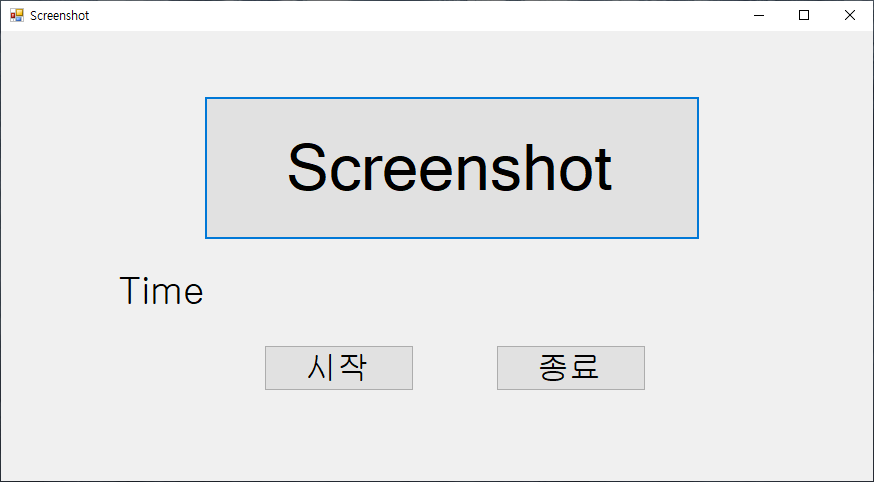
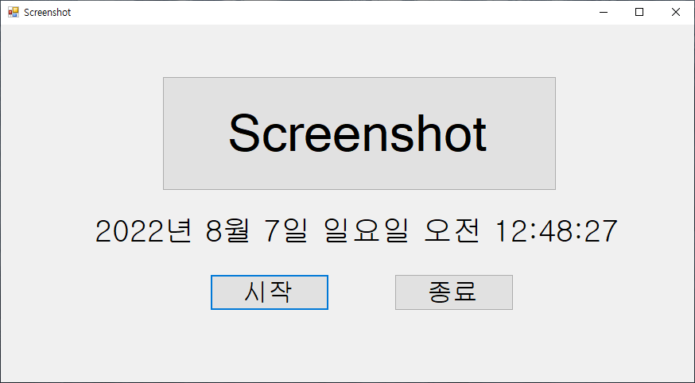

# Auto-Screenshot
스크린샷 자동화

## 정보

'Screenshot' 버튼을 누르면 현재 모니터의 화면을 캡쳐합니다.

(연결한 모니터가 1대일 경우 정상 동작하며 만약 여러 대의 모니터를 사용중인 경우에는 추후에 코드 추가 예정)

'시작'버튼을 누르면 타이머가 실행됩니다.

현재 시간이 조건에 맞는 시간과 일치할 경우 화면을 캡쳐합니다.

'종료'버튼을 누르면 대화상자가 나타납니다.

## 참고한 사이트

[[C# 팁] C# 으로 화면 캡쳐하기 (Screen Capture)](https://youtu.be/3BUFWT25L6s)

[C# 윈폼 - 현재 날짜 시간 실시간으로 가져오기](https://unininu.tistory.com/471)

[[C#]현재 날짜 및 시간 가져오기](https://developer-talk.tistory.com/147)

[[C#] Timer 사용법(Using Timer Control)](https://m.blog.naver.com/goldrushing/220000074957)

[[C#] 윈폼 프로젝트 만들기, 버튼 클릭, 텍스트 박스 출력까지](https://manniz.tistory.com/entry/C-윈폼-프로젝트-만들기-버튼-클릭-텍스트-박스-출력까지)

[[C#] 타이머(Timer) 제어하기](https://m.blog.naver.com/sjwsjw80/222001872313)

[[C#] 관리자 권한으로 실행하기 (Run as administrator)](https://rudalskim.tistory.com/365)

[[C#] 폴더 유무체크 / 폴더 만들기 (생성하기)](https://devkimgoon.tistory.com/45)

[[C# 윈폼] 윈폼 폼 닫기 이벤트 (Form Closed Event) 선언하는 방법](https://afsdzvcx123.tistory.com/entry/C-%EC%9C%88%ED%8F%BC-%EC%9C%88%ED%8F%BC-%ED%8F%BC-%EB%8B%AB%EA%B8%B0-%EC%9D%B4%EB%B2%A4%ED%8A%B8-Form-Closed-Event-%EC%84%A0%EC%96%B8%ED%95%98%EB%8A%94-%EB%B0%A9%EB%B2%95)

[C# 폼을 닫거나 종료 단추 누를 때 물어보고 처리하기](https://blog.daum.net/sualchi/13720504)

[[C#] 폼 x버튼 누를 때, 폼 종료시](https://blaseed.tistory.com/244)

[MessageBoxButtons 열거형](https://docs.microsoft.com/ko-kr/dotnet/api/system.windows.forms.messageboxbuttons?view=windowsdesktop-6.0)
